# cad-gen — Agentic Generation of CAD Geometry

**Project report and handover** · BMW Group · 13 June – 31 July 2026
Author: Phi Linh, AI Software Engineer · ~8,800 lines of Python across 39 modules, 34 commits

> This document is the canonical report. `docs/report/cad-gen-report.html` is the same content
> as a self-contained page for sharing. The operator manual lives in the repository
> [`README.md`](../../README.md); this is the *why*, the *what it produces*, and the
> *what to do next*.

---

## Contents

1. [Summary](#1-summary)
2. [The GEARS framework](#2-the-gears-framework)
3. [Architecture](#3-architecture)
4. [Demonstrations](#4-demonstrations)
5. [What the numbers say](#5-what-the-numbers-say)
6. [Setup and usage](#6-setup-and-usage)
7. [BMW-internal notes](#7-bmw-internal-notes)
8. [Limitations](#8-limitations)
9. [Future steps](#9-future-steps)
10. [Handover map](#10-handover-map)

---

## 1. Summary

- **The problem.** A technical drawing is a complete, unambiguous specification of a part — to a
  human. To a CAD system it is a picture. Getting from one to the other is manual work, repeated
  thousands of times across an engineering organisation.
- **What cad-gen does.** It turns a technical drawing (or a text specification, or both) into real,
  manufacturable CAD geometry — **STEP + STL** — by having an LLM write CAD code, executing that
  code against a real geometry kernel, measuring the result, and refining until it passes a quality
  bar. The same loop also **edits an existing model** from a written instruction.
- **The design principle.** *The LLM proposes; something deterministic decides.* Every signal the
  critic is given — kernel-measured metrics, the drawing-reprojection overlap, the OpenCASCADE
  validity verdict, the before/after edit diff — is computed from the geometry, never self-reported.
  The unambiguous ones (an invalid solid, an unchanged model) override the critic outright rather
  than arguing with it.
- **How it is organised.** As a five-stage loop — **GEARS**: **G**enerate, **E**valuate,
  **A**ggregate, **R**efine, **S**top. Section 2 maps each stage to the code that implements it.
- **What it ships as.** A CLI (`cad-gen`), an importable async library (`generate_cad`), a
  Next.js + FastAPI dashboard that streams each iteration live and orbits the result in 3D, and a
  benchmark harness (`cad-gen-bench`) that drives the loop over all 81 CADGenBench samples and
  assembles a leaderboard submission.
- **Provider-agnostic.** Built on PydanticAI, so any supported LLM provider works by changing one
  model string. On a locked-down BMW machine, one environment variable routes every agent through
  the internal gateway instead.

### The result, in one picture

The input is a Tier-4 practice drawing that asks for the part's mass to ±1 g. The output is a
watertight solid whose bounding box matches the drawing exactly — 135.0 × 85.0 × 65.0 mm — from
which the mass follows directly.

| Input: the drawing | Output: the generated solid |
|---|---|
| 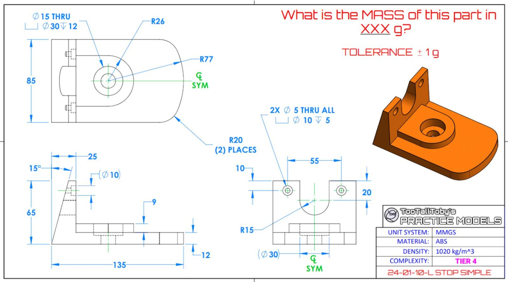 | 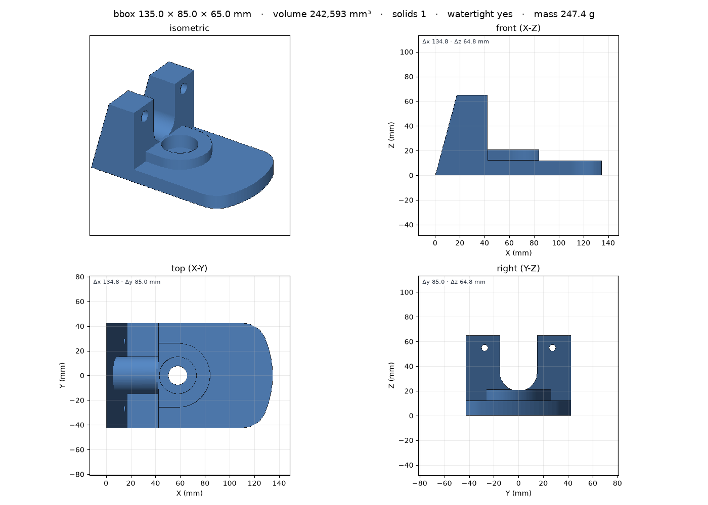 |

---

## 2. The GEARS framework

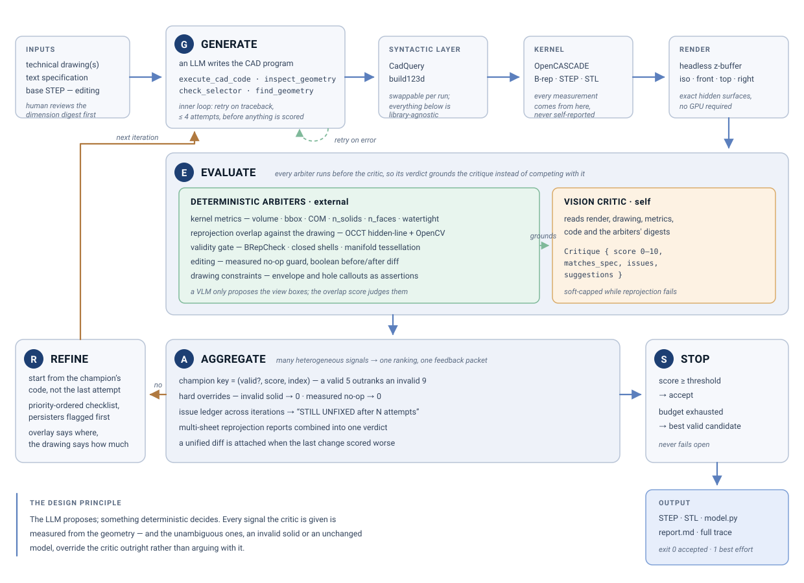

The loop is deliberately **orchestrated, not autonomous**. Application code owns the
iterate–score–stop logic and the agents are steps inside it. A single agent holding all the tools
and deciding when to stop was considered and rejected during design: it can skip the critique, stop
early, or loop indefinitely, and none of it is testable offline. The explicit loop gives a
guaranteed critique every iteration, enforceable budgets, and a suite that runs with no API key.

### The five stages

| Stage | What happens | Where it lives | The choice that matters |
|---|---|---|---|
| **G** — Generate | An LLM writes the CAD program from the spec, the drawing, and the previous round's feedback. An **inner correctness loop** lets it run its own code via `execute_cad_code` and fix tracebacks *before anything is scored* (≤ 4 attempts). Read-only probes — `inspect_geometry`, `check_selector` / `check_selection`, `find_geometry` — let it confirm a face or edge selection before committing to it. | `agents/generator.py`, `agents/prompts.py`, `sandbox/` | The syntactic layer is swappable per run (`--library cadquery\|build123d`). Both compile to the same OpenCASCADE kernel, so everything downstream is library-agnostic. |
| **E** — Evaluate | Five deterministic arbiters run first: kernel metrics (volume, bbox, centre of mass, solid and face counts, watertightness); the **reprojection overlap** of the solid against the drawing's line work; the **validity gate** (BRepCheck, closed shells, manifold tessellation); the **no-op guard** and boolean **edit diff** for editing; and the structured drawing constraints. Only then does the vision critic score it. | `sandbox/harness.py`, `rendering/renderer.py`, `reproject/`, `step_validity.py`, `step_metrics.py`, `edit_diff.py`, `agents/critic.py` | Every arbiter runs **before** the critic, so its verdict *grounds* the critique instead of competing with it. In the reprojection check a VLM only *proposes* the view boxes — a deterministic overlap score judges them, so the check can false-negative but can never fake a pass. |
| **A** — Aggregate | Heterogeneous signals collapse into one ranking and one feedback packet: hard overrides (invalid → 0, measured no-op → 0), a soft cap that forbids a passing score while the reprojection check fails, the validity-first champion key, multi-sheet reprojection reports combined into one verdict, and an issue ledger that tracks each critique issue across iterations by fuzzy match. | `orchestrator.py` — `_champion_key`, `_force_invalid_critique`, `_force_noop_critique`, `_update_ledger`, `_select_by_edit_diff`; `reproject/adapter.py` — `combine_reprojection_reports` | **A valid 5 outranks an invalid 9.** An invalid solid is worth zero downstream whatever else is right about it, so validity is the first sort key and the scalar score only ranks *within* the valid set. |
| **R** — Refine | The next prompt is anchored on the **champion**, not the last attempt: its code, a fix-it checklist ordered by persistence (`STILL UNFIXED after N attempts` for repeat offenders), the reviewer's suggestions, the reprojection overlay as a spatial locator, and a unified diff of the change when the last one scored worse. | `orchestrator.py` — `_build_feedback`, `_format_checklist`, `_format_regression`, `_build_prompt` | Anchoring on the champion is what stops the loop drifting away from a good design. The overlay says **where** the geometry disagrees; the original drawing remains the only source of **how much** — the overlay is dimensionless and the prompt says so. |
| **S** — Stop | Accept as soon as the effective score reaches the threshold; otherwise exhaust the iteration budget and return the best **valid** candidate. Bounded at every level: attempts per iteration, sandbox timeout, and separate subprocess timeouts for the reprojection, validity and edit-diff checks. | `orchestrator.py` loop, `RunConfig`, `cli.py` exit codes | The run never fails open. A best-effort artifact is always written and flagged — exit `0` accepted, `1` budget exhausted, `2` configuration error. |

### Two things worth noting about the loop

- **The critic is the *least* trusted component**, not the most. It is the only stage whose output
  can be silently wrong, so it is sandwiched: fed measured evidence beforehand, and overridden
  afterwards when a measurement contradicts it.
- **Every gate degrades to "no verdict", never to "reject."** A reprojection subprocess that times
  out, a validity check that crashes, a VLM that fails to locate views — each withholds its signal
  rather than penalising the candidate. A flaky native call must not cost a good iteration its
  champion slot.

---

## 3. Architecture

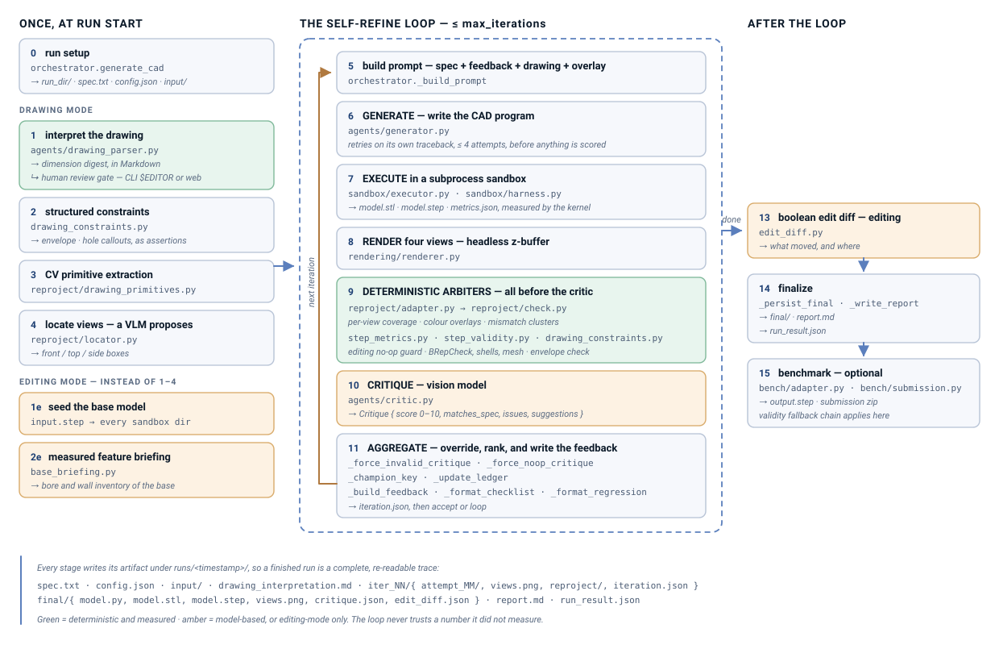

**Stack.** Python ≥ 3.12 · [PydanticAI](https://ai.pydantic.dev/) for provider-agnostic typed
agents · [CadQuery](https://cadquery.readthedocs.io/) or
[build123d](https://build123d.readthedocs.io/) on [OpenCASCADE](https://github.com/CadQuery/OCP) ·
NumPy z-buffer renderer (no GPU, no OSMesa) · OpenCV for drawing line masks and overlays ·
Typer + Rich CLI · FastAPI + SSE backend · Next.js 16 / React 19 / Three.js frontend · `uv` for
locked, reproducible installs · pytest + Ruff.

**Notes on the parts that carry the weight:**

- **The sandbox** (`sandbox/`) runs generated code in a subprocess and returns STL, STEP and
  kernel-measured metrics. It provides crash, timeout and state isolation — **it is not a security
  boundary**, and the web backend makes it reachable over HTTP, so that service must never be
  exposed publicly without container isolation and auth.
- **The reprojection check** (`reproject/`) is the correctness anchor for drawings. It projects the
  solid into orthographic views with OpenCASCADE hidden-line removal, snaps the VLM-proposed view
  boxes to the drawing's actual ink, and scores overlap in a resolution-independent way. It emits a
  colour-coded overlay — blue = a drawing line not reproduced, orange = a line added that the
  drawing lacks, red = match. Design rationale is in `reproject/README.md` and
  `reproject/DECISIONS.md`.
- **The validity gate** (`step_validity.py`) mirrors CADGenBench's own checks, in its order,
  against the STEP file exactly as it would be submitted. It is deliberately self-contained —
  stdlib plus raw OCP, no `cad_gen` imports — so it can run as a subprocess script by path.
  OpenCASCADE will not honour a Python signal mid-call, so in-process is not a safe place for it.
- **Editing mode** substitutes three things and leaves the loop identical: the base model is seeded
  into every sandbox directory as `input.step`; a measured **feature briefing** of its bores and
  walls goes into every prompt (`base_briefing.py`), because instructions name features in
  engineering language — *"the largest-diameter bore"* — and sampling 12 faces of a 1000-face import
  will not find them; and the drawing-versus-solid arbiter is replaced by two base-versus-candidate
  ones, a per-iteration no-op guard and a post-loop boolean edit diff.
- **Offline-testable by construction.** The suite uses PydanticAI's `TestModel` / `FunctionModel`
  with `ALLOW_MODEL_REQUESTS=False`, so the whole loop runs with no API key and no network. The
  geometric checks are tested against **real OpenCASCADE**, not mocks — a mocked `BRepCheck` would
  simply agree with whatever the code believed. Generator prompts are pinned to snapshots under
  `tests/snapshots/`, so rewording one is a deliberate act.

---

## 4. Demonstrations

All five are real runs and every image is an artifact taken straight from a run directory. The first
four come from the archive; **§4.5 was executed live for this report** and is documented exactly as
it happened, including the fact that it failed to converge.

### 4.1 Generation from a drawing — the loop converging

Drawing: *TooTallToby 24-01-10-L "STOP SIMPLE"*, Tier 4 — three orthographic views, counterbores,
a 15° draft, an R15 notch and an R77 rounded end. Run `runs/20260614_121540`, accepted 10/10 at
iteration 3 of 3.

| Iteration 1 — 5/10 | Iteration 3 — 10/10, accepted |
|---|---|
| 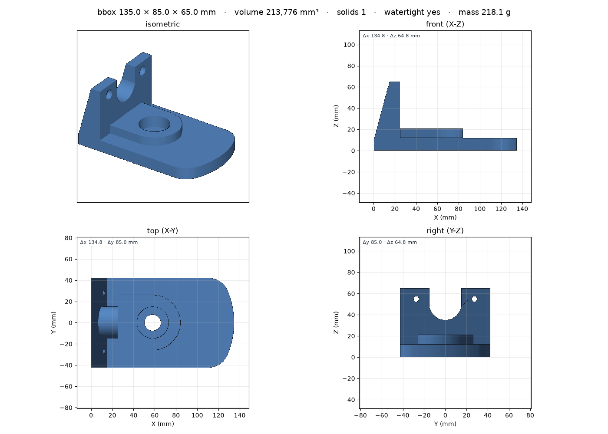 |  |

What the loop actually did, from `report.md`:

| # | Score | The critique that drove the next iteration |
|---|---|---|
| 1 | 5/10 | "U-slot center is positioned 5 mm below the lug holes instead of the specified 20 mm, making the slot 15 mm too shallow" |
| 2 | 5/10 | "The back sloped face is interrupted by a 12 mm vertical step and a horizontal ledge at the bottom-left. The drawing shows a single continuous 15° plane" |
| 3 | **10/10** | accepted — `matches_spec: true`, no issues |

Every deterministic check passed on the accepted candidate: one fused solid, watertight, envelope
135.0 × 85.0 × 65.0 mm against the drawing's 135 × 85 × 65, and every required hole diameter present
as a cylindrical face. Volume 242,593 mm³ → **247.4 g** in ABS at 1020 kg/m³, which is what the
drawing asks for.

Note the shape of the trajectory: iteration 2 did **not** improve on iteration 1 — it scored the
same and broke something else. The loop does not simply continue from whatever ran last; it selects
a champion by `(valid?, score, index)` each round and refines *that*, carrying a checklist in which
anything still unfixed is escalated. Two rounds of critique later, the third attempt cleared the
bar outright.

### 4.2 How the drawing is read

Before anything is generated, the drawing is decomposed. A VLM proposes where the front, top and
side views are; OpenCV extracts the geometry-line mask; each proposed box is then **snapped to the
ink it actually contains**. The VLM never scores anything — it only points.

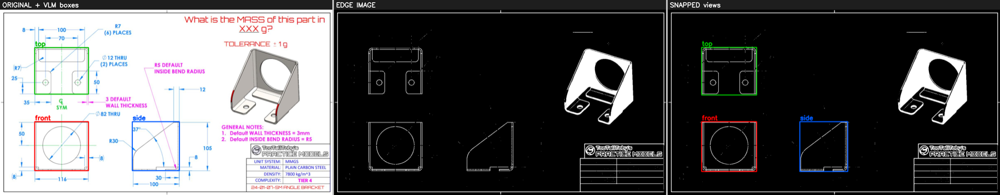

*Left: the original drawing with the VLM's proposed boxes. Centre: the extracted edge image —
dimension lines, text and title block filtered out. Right: the boxes snapped to the real extent of
each view.* This is what makes the per-view reprojection score meaningful; without it, a comparison
against the full sheet would be dominated by annotation.

### 4.3 Editing an existing model, with the change measured

Instruction, from CADGenBench sample 250:

> *"Increase the length of the only boss in the model with no fillet on its mounting face such that
> it is flush with the next nearest mounting hole."*

The base model is a cast housing with roughly a thousand faces. The instruction names its target in
engineering language, not coordinates.

| The base model (`input.step`) | The material the edit moved — and nothing else |
|---|---|
| 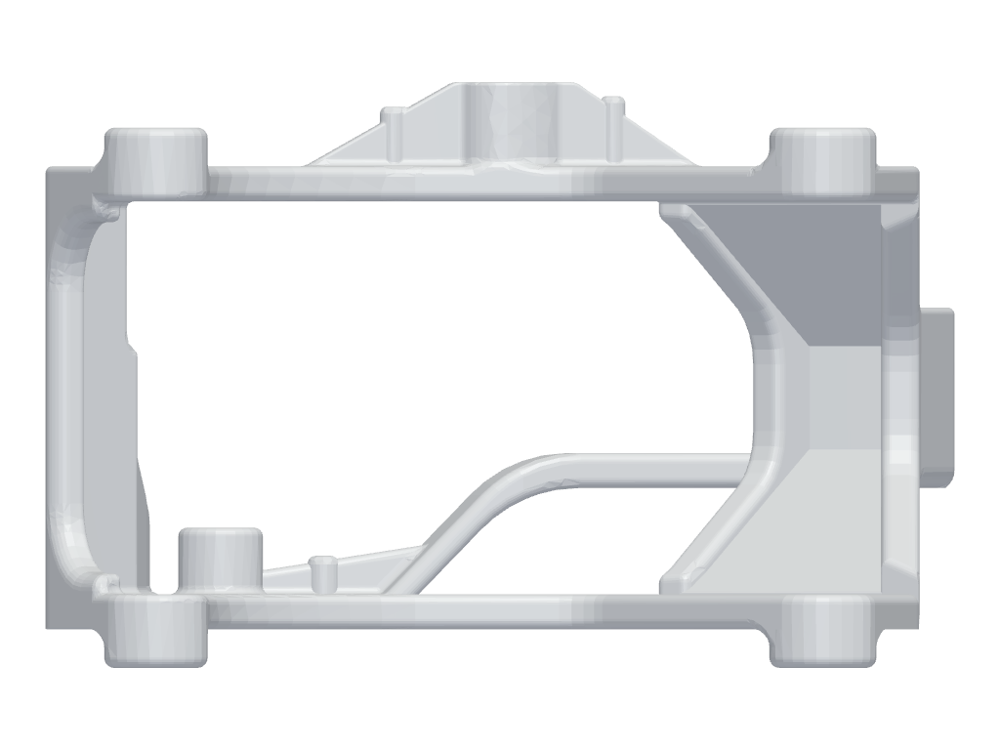 | 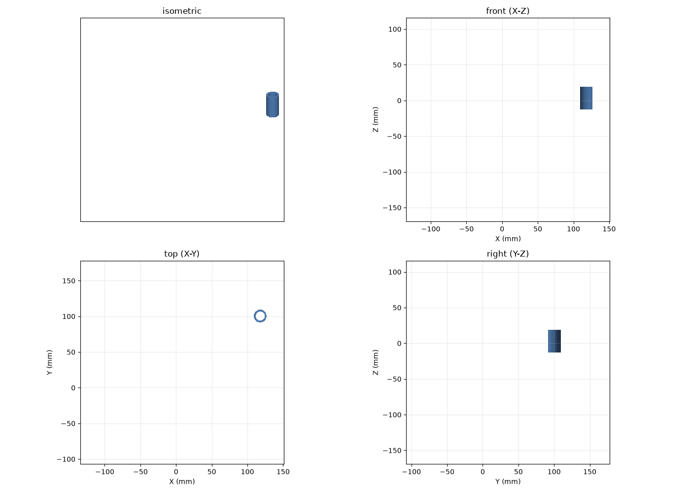 |

The candidate is cut against the base model in both directions, so what changed is measured rather
than eyeballed (`final/edit_diff.json`):

```
base volume:      632,495.4 mm³
material removed:       0.0 mm³ in 0 regions
material added:     4,049.6 mm³ in 1 region
changed fraction: 0.640 % of the base volume
locality:         0.106  (changed bbox diagonal / part bbox diagonal)
  added: 4,049.6 mm³, bbox 18.0 × 18.0 × 31.5 mm, at (118.0, 100.5, 3.3)
```

**One region, nothing removed, 0.64 % of the part.** That is the signature of a correct local edit,
and it is the thing an after-render cannot show you — at this scale the edited part looks identical
to the base. It is also what catches the two failure modes a volume comparison misses: an over-cut,
and a from-scratch rebuild that happens to look right.

### 4.4 A failure, shown honestly

CADGenBench sample 115 — a formed sheet-metal part. The model produced a flat plate carrying a
plausible cutout pattern, and never produced the formed 3D structure.

| The reprojection overlay, iteration 1 | What was actually built |
|---|---|
| 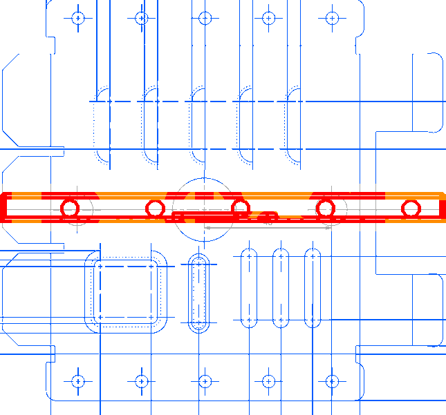 | 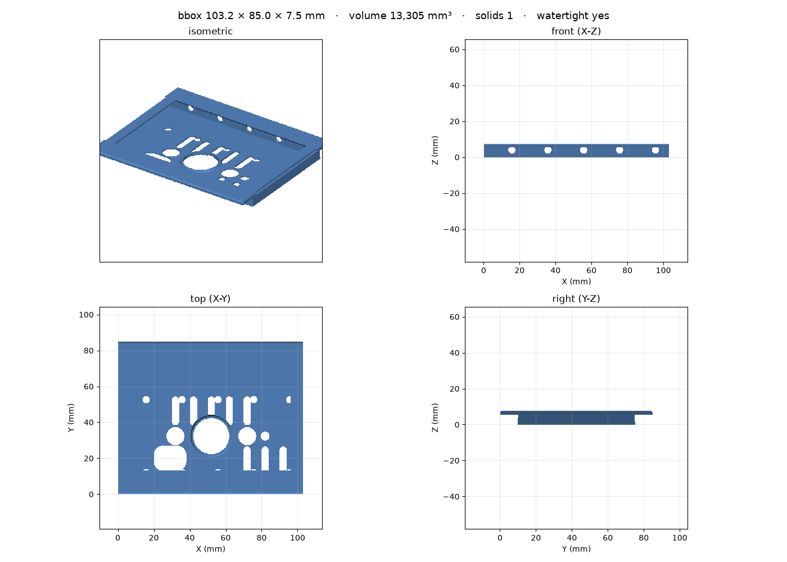 |

In the overlay, **blue** is drawing line work the model failed to reproduce and **red/orange** is
what it did produce — a thin band where a tall formed structure should be. Front-view coverage
stalled at exactly 10 % in every scored iteration; the top view never got past 59 %.

This is precisely why the check is **per orthographic view**. Seen from above, the part is nearly
right, and a single-view or purely visual comparison would have scored it well. The run correctly
refused to accept it: best score 4/10, verdict `NOT ACCEPTED (budget exhausted)`, best-effort
artifact written and flagged.

### 4.5 A live run, end to end through the dashboard

Everything above is drawn from the archive. This section is a **run executed live on 3 August 2026
specifically for this report**, driven through the web dashboard from an empty form to a finished
artifact, with each stage captured as it happened. Same drawing as §4.1, default settings:
5 iterations, accept ≥ 8, `openai-responses:gpt-5.6-luna`, CadQuery.

It did **not** converge. That turns out to be the more useful outcome, and it is reported as it
happened — see §4.5.6.

#### 1 · The request

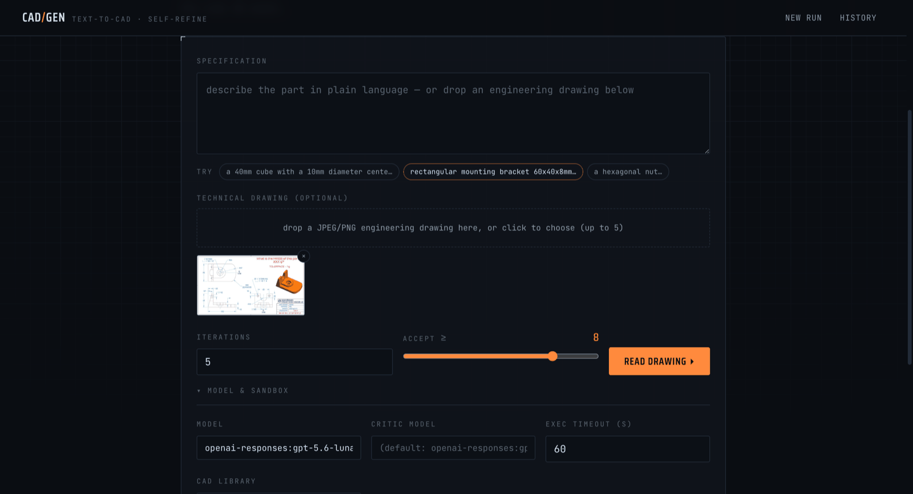

A specification, a drawing, or both. The iteration budget and the accept threshold are the two
knobs that matter; **model & sandbox** exposes the generator model, the critic model, the sandbox
timeout, and the CadQuery/build123d switch. With a drawing attached the primary action changes from
**generate** to **read drawing** — the drawing has to be interpreted before anything is built.

#### 2 · The human review gate

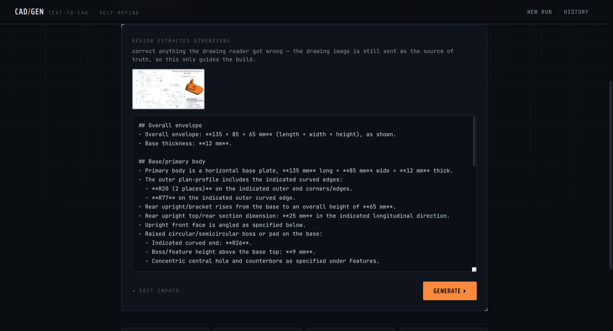

This is the **HITL step**: the drawing reader's extracted dimensions come back as editable text, and
the operator corrects anything wrong before a single line of CAD code is written. Note the framing
in the UI — *"the drawing image is still sent as the source of truth, so this only guides the
build"*. The digest is a hint, never a replacement for the drawing.

On this run the extraction needed no correction. It recovered the 135 × 85 × 65 mm envelope, the
12 mm base, R20 / R77 / R26 / R15, the 15° draft, `Ø15 THRU` with `⌴ Ø30 ↧12`, `2× Ø5 THRU` with
`⌴ Ø10 ↧5` at 55 mm spacing, both symmetry planes — and, from the title block, the ABS density of
1020 kg/m³ and the **±1 g mass tolerance** the drawing is really asking about.

#### 3 · The loop, streaming

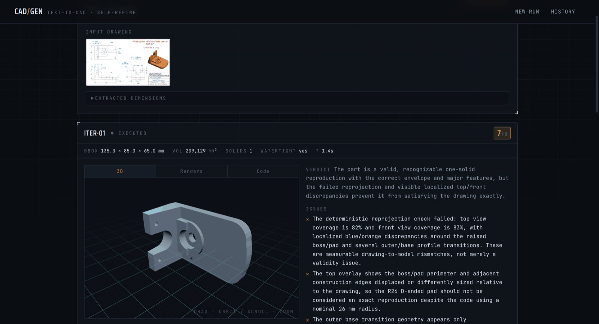

Each iteration is pushed over SSE the moment its critique lands, so the loop is observable while it
runs rather than after it finishes.

#### 4 · One iteration, in full

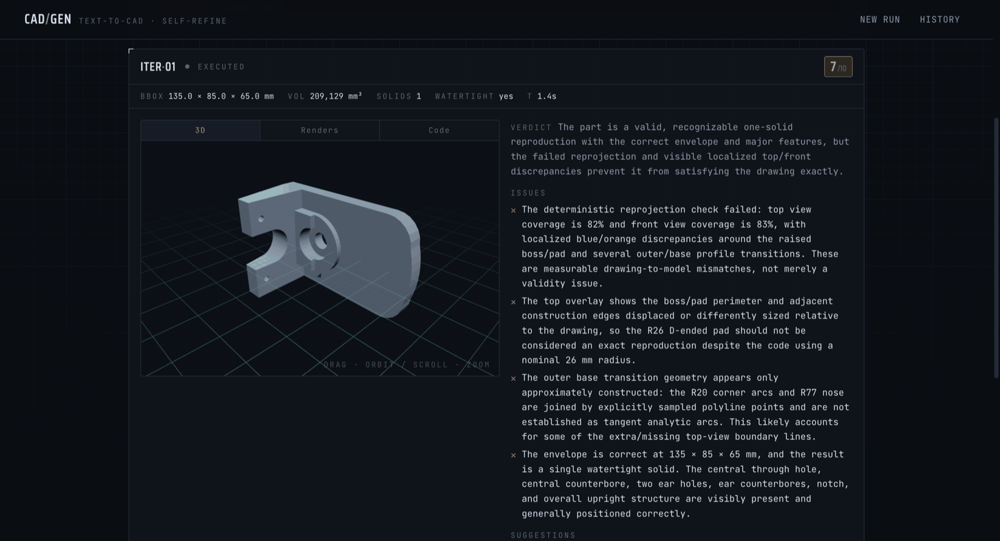

The header carries the **kernel's own measurements** — bounding box, volume, solid count,
watertightness, execution time. The left pane is the real generated solid in an orbitable 3D view,
not a picture of it. The right pane is the structured critique.

Read the first issue closely: *"The deterministic reprojection check failed: top view coverage is
82 % and front view coverage is 83 %…"* The critic is not guessing from the render — it is quoting
the geometric arbiter that ran before it. That is the §2 design principle visible in the product.

#### 5 · What the arbiter actually measured

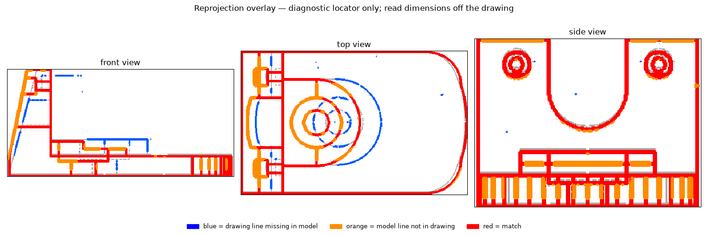

The overlay behind that number, from the same iteration: **red** where the model's reprojected edges
match the drawing, **blue** where a drawing line was not reproduced, **orange** where the model added
one. Measured coverage was front 82.6 %, top 81.9 %, side 99.9 % — a near-perfect side view, with the
disagreement concentrated exactly where the critic said it was: the D-ended R26 pad in the top view
and the outer base profile transitions.

Contrast this with §4.4, where the same check returned 10 % and localised a catastrophic failure.
Here it is doing the harder job — separating *almost right* from *right*.

#### 6 · The result: budget exhausted

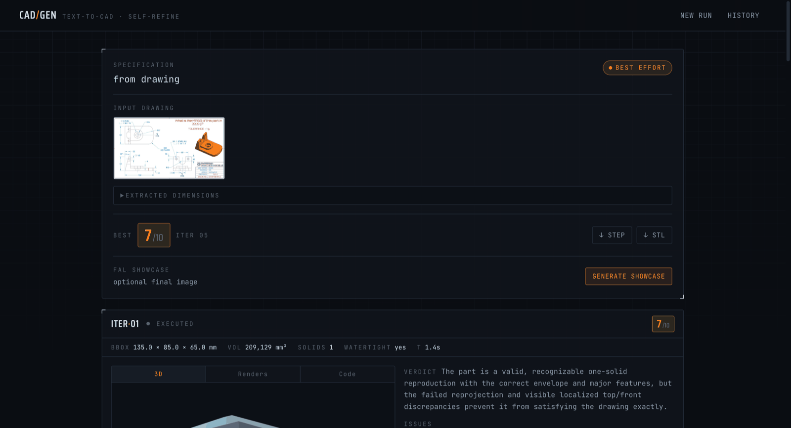

| Iteration | 1 | 2 | 3 | 4 | 5 |
|---|---|---|---|---|---|
| Score | 7 | 6 | 7 | 7 | **7** |

Final verdict `NOT ACCEPTED (budget exhausted)`, best score 7/10 against a threshold of 8. The run
still wrote a complete artifact — one watertight solid, 35 faces, envelope exactly
135.0 × 85.0 × 65.0 mm, volume 211,438 mm³ → 215.7 g — downloadable as STEP or STL, and flagged
**BEST EFFORT** rather than presented as a success.

| What it shipped | The accepted run of §4.1, for comparison |
|---|---|
| 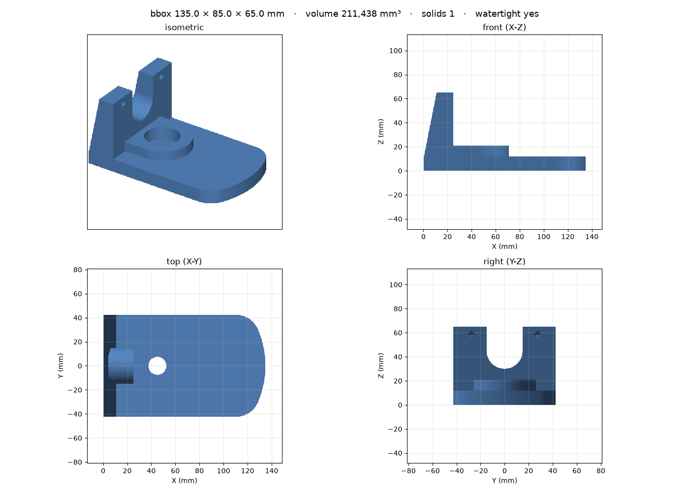 |  |

Side by side, the difference is not obvious to the eye — which is the whole argument for measuring
rather than looking. The visible tells are the D-ended pad in the top view and the base profile;
the decisive one is 215.7 g against 247.4 g.

Three things this run demonstrates better than a lucky success would have:

- **The envelope check held again.** Thirteenth run of this drawing, thirteenth exact
  135.0 × 85.0 × 65.0 mm bounding box (§5.2).
- **The critic was right to refuse.** At 215.7 g this candidate is ~32 g outside the 247 g
  consensus of §5.2 — far beyond the drawing's ±1 g tolerance. The threshold did its job.
- **It plateaued, and nothing noticed.** Iterations 3, 4 and 5 all scored 7 with substantially the
  same critique — reprojection failing at 82 % top, 85–86 % front. Three iterations of budget bought
  no improvement. This is precisely the case the unbuilt `|Δ| < ε` stopping condition in §9.1 exists
  for, and the clearest argument in this report for building it.

#### 7 · The generated source, and where it went wrong

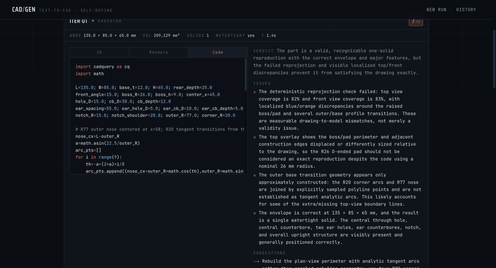

Every run keeps its code. The parameters are traceable straight back to the drawing callouts —
`L=135.0`, `boss_R=26.0`, `hole_D=15.0`, `cb_D=30.0`, `ear_spacing=55.0`, `outer_R=77.0`,
`corner_R=20.0` — and so is the defect: the R77 nose and its R20 transitions are built from a
9-point sampled polyline (`for i in range(9)`) instead of tangent analytic arcs. That approximation
is what the top-view overlay was flagging, and the critic named it and proposed the fix. The loop
diagnosed itself correctly and still could not execute the correction within budget.

#### 8 · Renders and history

| Every iteration's 4-view render | Run history |
|---|---|
| 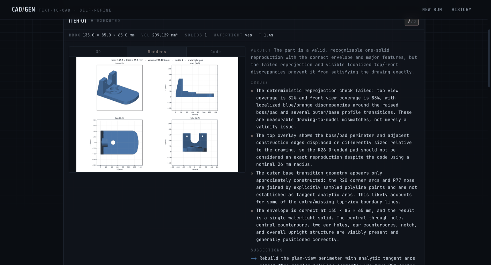 | 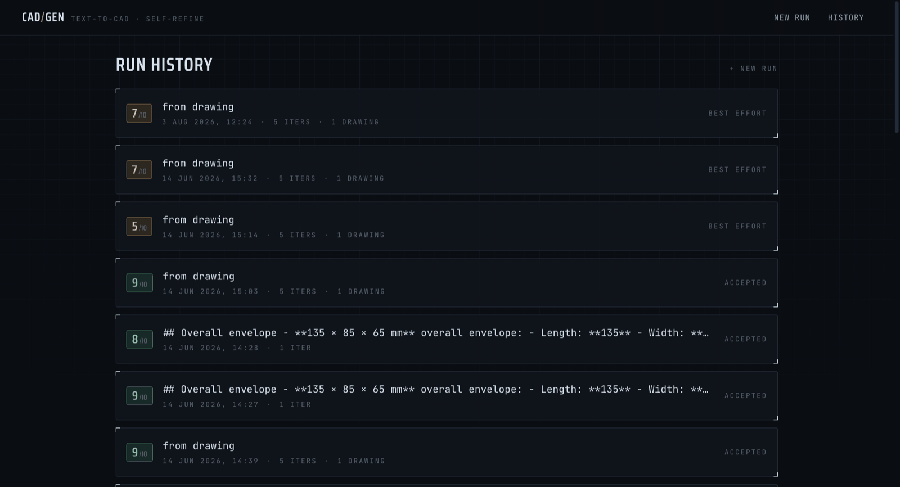 |

The renders tab shows exactly what the critic was shown. The history view lists every run with its
score and verdict — the 3 August run at the top, flagged **BEST EFFORT** in amber against the
**ACCEPTED** runs in green.

---

## 5. What the numbers say

**Scope note.** CADGenBench's official CAD Score is computed server-side against private ground
truth and is not reproducible locally, so it is not reported here. Everything below is measured
from artifacts in this repository, and each number states what it covers.

### 5.1 Validity of the v4 submission — the complete set

The benchmark zeroes a sample outright if its solid is not valid, so validity is the one axis that
can be checked locally, and it was, on all 81 submitted files (`step_validity.py`, run over
`results/cadgen-v4/*/output.step`):

| Task family | Samples | Passing the validity gate |
|---|---|---|
| Generation | 49 | **49 / 49** — 100 % |
| Editing | 32 | **30 / 32** — 94 % |
| **Total** | **81** | **79 / 81 — 97.5 %** |

- Both failures (samples 202 and 240) are editing tasks, and both report the same OpenCASCADE
  defect: `Face: BRepCheck_UnorientableShape`.
- For comparison, the audit of the **v3** submission recorded in `step_validity.py` found **7 of 81**
  candidates failing the same gate, five of them editing tasks. The v4 run reduced that to two —
  the validity gate, the validity-first champion key and the fallback chain were added in response
  to exactly that audit.
- Of the 16 samples whose full traces were preserved, 10 were accepted by the loop and 6 exhausted
  their budget. Among the 14 preserved editing traces, **one** (sample 242) shipped its unmodified
  `input.step` because no valid edited candidate survived — a deliberate fallback, worth partial
  credit where an invalid edit is worth zero, and printed in red by the harness because it is a
  failure, not a success.

### 5.2 Repeatability on one part — thirteen runs, one drawing

Twelve archived runs used the same Tier-4 drawing (§4.1) across two scans of it, and the live run of
§4.5 makes thirteen. Comparing their final geometry isolates how much of the outcome is the system
and how much is the sampling:

| Measure | Result |
|---|---|
| Bounding box exactly 135.0 × 85.0 × 65.0 mm | **13 / 13** — including every run the critic rejected |
| Mass within 247.0 – 247.4 g (a 0.4 g spread) | **6 / 13** |
| Accepted by the critic | 8 / 13 |
| …of those, inside the 0.4 g consensus | 5 / 8 |

- **The deterministic envelope check is unanimous.** Every run, accepted or not, reproduced the
  drawing's overall dimensions exactly. That check is a hard assertion derived from the dimension
  digest, and it does what it was built to do.
- **The scalar critic is not.** It accepted three runs outside the consensus — off by 3.8 g, 3.9 g
  and 48.8 g — and rejected one run that landed *inside* it at 247.4 g. Against the drawing's own
  ±1 g tolerance, that is a real false-accept and a real false-reject. It also, in the live run,
  correctly refused a candidate at 215.7 g — so the threshold works; it is the score's resolution
  between 7 and 8 that is unreliable, not its direction.
- **This is the strongest single argument in the report for the design principle**, and for the
  most valuable unbuilt feature: a consensus or self-consistency vote across candidates would have
  caught all four of those errors using signal the system already produces. See §9.
- Consistency is not accuracy. The drawing's true answer is not in this repository, so six runs
  agreeing to 0.4 g is evidence of a stable attractor, not proof it is the right one.

---

## 6. Setup and usage

### Install

```bash
git clone <repo-url> cad-gen && cd cad-gen
uv sync                       # locked virtualenv in .venv/
cp .env.example .env          # then paste your OPENAI_API_KEY
```

The CAD kernel and the renderer are pure Python wheels — no system OpenGL or OSMesa. Optional
extras: `uv sync --extra web` (dashboard backend), `--extra bench` (benchmark harness),
`--extra build123d` (alternative CAD library). A VS Code dev container is included.

### CLI

```bash
# from a technical drawing — opens the extracted dimensions for review first
uv run cad-gen "bracket" --drawing path/to/drawing.jpeg

# higher quality bar, bigger budget, the other CAD library
uv run cad-gen "mounting bracket" --drawing drawing.jpeg \
  --threshold 9 --max-iterations 6 --library build123d
```

| Option | Default | Meaning |
|---|---|---|
| `--max-iterations, -n` | 5 | outer refinement budget |
| `--threshold, -t` | 8 | critic score (0–10) required to accept |
| `--model, -m` / `--critic-model` | `openai-responses:gpt-5.6-luna` | generator / vision critic |
| `--library, -l` | `cadquery` | `cadquery` or `build123d` |
| `--drawing` | – | path to a drawing; repeatable for multi-sheet |
| `--timeout` | 60 | sandbox seconds per execution attempt |
| `--no-review` | off | skip the editable review of the extracted dimensions |

Exit codes: `0` accepted · `1` budget exhausted, best effort written · `2` configuration error.

### Library

```python
from cad_gen import RunConfig, generate_cad
from cad_gen.models import DrawingAttachment

result = await generate_cad(
    "mounting bracket",                      # optional clarifying note
    RunConfig(max_iterations=6, score_threshold=8),
    drawings=[DrawingAttachment(data=..., media_type="image/jpeg")],
)
print(result.accepted, result.best.effective_score, result.run_dir)
```

Passing `base_step=<bytes>` instead switches the run to editing mode; `result.edit_diff.digest`
then reports what material the edit actually moved. Models, executor, renderer, reprojector and the
`on_iteration` callback are all injectable, which is what makes the suite offline.

### Web dashboard

```bash
uv sync --extra web && (cd web && pnpm install)
uv run --extra web uvicorn cad_gen.web.server:app --reload --reload-dir src/cad_gen   # :8000
cd web && pnpm dev                                                                    # :3000
```

Drop a drawing, review the auto-extracted dimensions, generate, and watch each iteration arrive
over SSE while orbiting the real solid in 3D. `--reload-dir` scopes the file watcher to source so a
run writing into `runs/` does not restart the server mid-run. **[§4.5](#45-a-live-run-end-to-end-through-the-dashboard)
walks the whole flow through screenshots of a real run**, from empty form to downloadable STEP.

Two things worth knowing when driving it: a run's live URL uses an ephemeral session id, while the
permalink under **history** uses the run directory name — a completed run should be reopened from
history, not from the URL it streamed on. And the optional **fal.ai showcase** button only appears
usefully when `FAL_KEY` is set on the backend; without it the endpoint returns 404 and the button
does nothing.

### Benchmark harness

```bash
uv sync --extra bench
uv run --extra bench cad-gen-bench run --limit 2 --max-iterations 2 -o results/smoke   # smoke test
uv run --extra bench cad-gen-bench run -o results/cadgen-v4 -n 5 -j 4                  # all 81, resumable
uv run --extra bench cad-gen-bench package results/cadgen-v4 --submitter "…" --name "…" --agree
```

Inputs come from the public Hugging Face dataset; the private ground truth is never needed locally.
`--task-type generation|editing|all` narrows the run. Each sample's full trace lands under
`results/<run>/<sample>/cadgen/`; only `output.step` is packaged.

### Tests

```bash
uv run pytest        # 287 tests, offline: scripted models, no API calls (enforced)
uv run ruff check .
```

At the time of writing, all 287 pass in under two minutes with no API key set, and Ruff is clean.

---

## 7. BMW-internal notes

> **This section is BMW-specific. Delete it to make this document shareable outside the company.**
> Nothing elsewhere in this report depends on it.

- On a BMW machine the public provider endpoints are unreachable; only BMW's OpenAI-compatible
  gateway is. `CAD_GEN_BMW=1` routes **every** agent through it in one switch (default model
  `openai/gpt-5-mini`); an explicit `bmw:<model>` env var still overrides per agent, which is how
  you give the critic a vision-capable model while the generator uses something cheaper.
- Credentials go in `.env`: `LLM_API_PROD_KEY`, plus either `CLIENT_ID` + `CLIENT_SECRET` or a
  pre-fetched `LLM_ACCESS_TOKEN`. `src/cad_gen/bmw.py` fetches and refreshes the WebEAM bearer
  token and downloads BMW's CA bundle automatically; region and CA-cert overrides are documented in
  `.env.example`. The downloaded bundle is gitignored.
- Model identifiers follow the internal catalogue (`openai/gpt-5-mini`, `openai/gpt-4o`,
  `anthropic/claude-sonnet-4-5`, …), not the public ones. A model string that works on a laptop will
  not necessarily resolve on the gateway.
- Everything else — the kernel, the sandbox, the renderer, the reprojection check, the benchmark
  harness — is provider-independent and behaves identically either way.

---

## 8. Limitations

**Generation.**

- Simple prismatic parts — plates, brackets, blocks, holes, fillets — converge reliably.
- Parts needing a swept feature *fused* to a body (a mug handle is the canonical case) sit at the
  edge of current model capability. The model often leaves the feature as a separate unfused solid;
  the ground-truth `n_solids` check catches it and the run returns its best effort rather than a
  wrong "accepted". That is the correct behaviour, but it is not a solution.
- Formed sheet-metal and other parts whose 3D structure is not readable from a plan view remain out
  of reach (§4.4).
- The scalar critic score is the weakest arbiter in the system and demonstrably admits both false
  accepts and false rejects (§5.2).

**Editing** is harder, and the deterministic checks bound the damage rather than removing it:

- The checks catch a bad edit; they do not produce a good one. A rejected candidate becomes a retry,
  and an exhausted budget still ships the best effort, flagged.
- **Not every invalid solid is repairable.** The OCCT repair ladder is verified through a STEP
  round-trip, because a shape can pass `BRepCheck_Analyzer` in memory and fail again once written
  and re-read. On the seven invalid candidates of the audited v3 submission the ladder fixed
  **none**; it is kept as a cheap rung for failure modes that run did not exhibit, and the fallback
  does the real work.
- **Some benchmark base models are themselves invalid** — three of the 32 editing inputs fail the
  validity gate as shipped. For those there is no valid no-op to fall back to, and the inherited
  defect must be regenerated by the edit itself (a boolean *through* the offending region usually
  does it) or the sample scores zero either way.
- `is_plausible_local_edit()` in `edit_diff.py` currently accepts every measured diff, so the
  locality gate **reports numbers without acting on them**. Its docstring carries the calibration
  data from the v3 audit; the thresholds exist, the enforcement does not.

**Operational.**

- The subprocess sandbox is isolation, not security. Generated code runs with the invoking user's
  privileges.
- The web backend has no auth and no persistent run store; it is a local development tool.

---

## 9. Future steps

### 9.1 Designed on the whiteboard, deliberately not built

These were part of the original framework sketch and were scoped out to get a complete, honest
pipeline working first. Each is a well-defined addition to a specific GEARS stage.

- **Aggregate — n candidates per iteration, then select.** Today one candidate is generated per
  iteration and the inner loop only retries tracebacks. Sampling *n* candidates and choosing among
  them is the single highest-value change: §5.2 shows the system already produces the signal — 5 of
  8 accepted runs of the same part agreed within 0.4 g while three did not, and a consensus vote
  over candidate volume and bounding box would have caught every one of those errors without a
  single extra evaluator.
- **Refine — scope the change.** Refinement is always a full rewrite anchored on the champion's
  code. A *patch* scope (edit only the implicated region) versus *complete regeneration* should be
  chosen per issue: dimension corrections are patches; a reversed feature usually needs a rebuild.
- **Stop — a plateau condition.** Stopping is currently on the score threshold or the iteration
  count. The sketched `|Δ| < ε` condition — stop when successive champions stop improving — would
  end runs like §4.4 after two iterations instead of five. The live run of §4.5 makes the case
  sharply: iterations 3, 4 and 5 each scored 7 with substantially the same critique, so **40 % of
  that run's budget bought nothing**, and the loop had no way to notice.
- **Refine — escape a local minimum.** Champion-anchoring is what keeps hard cases from diverging,
  and is also what traps them. Detecting a plateau (above) should trigger a deliberate restart from
  scratch, kept only if it beats the incumbent.
- **Evaluate — more arbiters.** The evaluate stage is built as a plug-in set of measured checks, so
  new ones drop in without touching the loop: CFD or FEM for functional parts, manufacturability
  (draft, wall thickness, tool access), and GD&T / tolerance conformance.
- **Evaluate — human in the loop, mid-run.** There is a review gate today, but only before the run:
  the operator edits the extracted dimension digest. Letting a human inject a correction *between
  iterations* is a small change to the feedback builder and the SSE contract.

### 9.2 Repository backlog

- **Act on the locality gate.** `is_plausible_local_edit()` measures and returns `True` regardless.
  Turning the calibrated thresholds on is a contained change with a real effect on editing scores.
- **A true hidden-surface renderer** (pyrender / OSMesa) to replace the NumPy z-buffer, for cleaner
  critic input on curved geometry.
- **Topology-specific dimension validators** beyond the bounding-box assertion — hole patterns,
  fillet radii, and angles as first-class checks rather than "unverified" callouts.
- **Multi-part assemblies**, which the whole pipeline currently assumes away (`n_solids == 1`).
- **Auth and a persistent run store** if the dashboard is ever hosted rather than run locally.

---

## 10. Handover map

**Read in this order.**

1. `README.md` — the operator manual: install, configuration, every CLI flag.
2. `docs/report/README.md` — this document: why it is shaped this way.
3. `src/cad_gen/orchestrator.py` — **the whole loop is one file, ~870 lines.** Read
   `generate_cad()` top to bottom and you have the system; everything else is a step it calls.
4. `pipeline.md` — stage-by-stage input/output reference. Written before editing mode, the validity
   gate and the edit diff existed, so trust the stage map in §3 where they disagree.
5. `src/cad_gen/reproject/DECISIONS.md` — why the drawing comparison works the way it does. The
   most subtle component, and the one with the most non-obvious constraints.

**What is load-bearing** — change carefully, and re-run the geometric tests:

- `orchestrator.py` — the loop, the champion key, the overrides, the feedback builder.
- `step_validity.py`, `edit_diff.py`, `step_metrics.py` — the deterministic verdicts. All three read
  through raw OCP deliberately, so they are independent of the CAD library in use.
- `reproject/check.py` — self-contained by design (OCP + OpenCV, no `cad_gen` imports) so it can run
  as a subprocess. Keep it that way.
- `agents/prompts.py` — pinned to snapshots in `tests/snapshots/`. Rewording a prompt means
  regenerating the snapshot in the same commit; that friction is intentional.

**What is scaffolding** — safe to replace:

- `web/` and `src/cad_gen/web/` — a demonstration UI, not a product.
- `rendering/renderer.py` — deliberately simple; the planned replacement is noted in §9.2.
- `bench/` — specific to CADGenBench's submission format.

**Known sharp edges:**

- The `build123d` extra is pinned `>=0.9,<0.10` for a concrete reason — 0.10+ moves to
  `cadquery-ocp-novtk` ≥ 7.9 and would upgrade the kernel underneath CadQuery *and* under
  `reproject/check.py`'s raw OCP imports. Read the comment in `pyproject.toml` before relaxing it.
- The default model string uses the `openai-responses:` prefix, not plain `openai:`. Every agent
  here needs tools, and the plain prefix resolves to Chat Completions, which rejects them. The
  reason is documented at the top of `models.py`.
- `runs/`, `results/` and `out_reproj_check/` are gitignored. The images in this report were copied
  into `docs/report/assets/` precisely so they survive.

---

*Report generated 3 August 2026. Every figure in §5 is reproducible from the artifacts in this
repository; the scripts that produced them are described inline in each subsection.*
